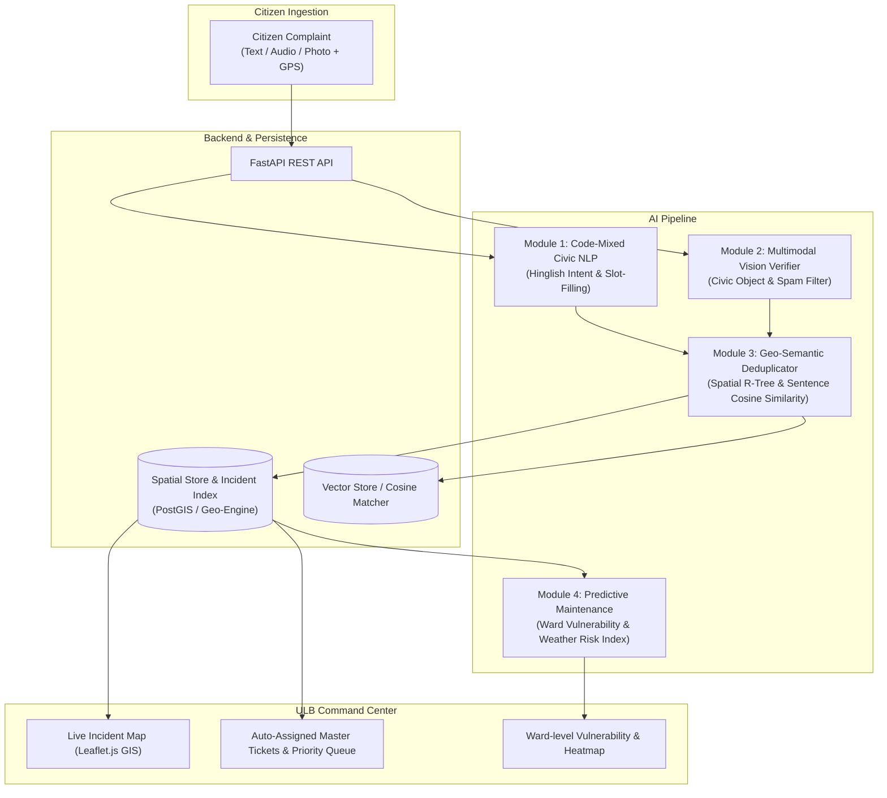

# SamAashwas (CivicSense AI) 🏛️🤖

**Municipal Grievance Intelligence & Predictive Maintenance System for Indian Urban Local Bodies (ULBs)**

[](LICENSE)
[](https://python.org)
[](https://fastapi.tiangolo.com)
[](https://leafletjs.com)

---

## 📌 Executive Summary

Indian Urban Local Bodies (such as BBMP Bengaluru, BMC Mumbai, MCD Delhi, PMC Pune) receive tens of thousands of citizen complaints daily across WhatsApp bots, web portals, call centers, and walk-ins. However, existing municipal systems suffer from three critical structural bottlenecks:

1. **Misrouting & Language Barriers:** Citizens submit grievances in code-mixed colloquial languages (*"Hinglish"*, regional Romanized dialects like *"Ward 12 gali mein sewer overflow ho raha hai"*). Keyword-based bots fail to assign the correct ward junior engineer (JE) or department.
2. **Duplicate Flooding:** When a civic failure occurs (e.g., water pipe burst, tree fall, blown transformer), 50–100 neighborhood citizens log separate complaints. Municipal dashboards drown in redundant tickets, paralyzing resolution tracking.
3. **Reactive vs. Predictive Maintenance:** Municipal engineers only respond after a catastrophic failure, rather than conducting proactive preventative maintenance on aging drains or transformers prior to the monsoon or heatwaves.

**SamAashwas (CivicSense AI)** resolves this with an end-to-end intelligence platform that automates multimodal intake, deduplication, vision validation, and proactive maintenance forecasting.

---

## 🌟 The 4 Core AI Modules



### 1. Code-Mixed Civic NLP (`nlp_engine.py`)
- Detects language (`Hinglish`, `Hindi`, `English`, `Regional`).
- Extracts intent, municipal department (`Sanitation & Solid Waste`, `Roads & Traffic Infrastructure`, `Water Supply & Sewage`, `Electrical & Streetlighting`, `Encroachment & Town Planning`, `Health & Vector Control`).
- Automatically extracts entities: Ward numbers, landmarks, street references, urgency level.

### 2. Multimodal Visual Verification (`vision_engine.py`)
- Detects civic target classes: `pothole`, `waterlogging`, `garbage_dump`, `sewage_overflow`, `broken_streetlight`, `fallen_tree`.
- Performs semantic cross-modal verification between user text and detected visual content.
- Filters out spam, random selfies, internet memes, and irrelevant uploads with an authenticity confidence score.

### 3. Spatio-Temporal Deduplication Engine (`deduplication.py`)
- **Geographic Gate:** Filters active incidents within a 300-meter radius using Haversine / PostGIS spatial distance.
- **Semantic Similarity:** Computes cosine similarity of text embeddings against active neighborhood tickets.
- **Master Ticket Aggregation:** If distance $\le 300\text{m}$ and semantic similarity $\ge 0.82$, merges into an existing **Master Ticket**, increments citizen endorsement count, and dynamically updates SLA urgency.

### 4. Predictive Municipal Maintenance (`predictive_engine.py`)
- Integrates historical complaint frequency (90-day density), asset age/materials, and real-time precipitation forecasts (via **Open-Meteo API**).
- Computes a **Ward Vulnerability Index (0–100)** to alert city commissioners and ward junior engineers ahead of heavy rainfall.

---

## 🏛️ Repository Structure

```
SamAashwas/
├── backend/
│   ├── app/
│   │   ├── api/                  # FastAPI router endpoints (complaints, master tickets, predictive, whatsapp)
│   │   ├── core/                 # Core AI engines (NLP, Vision, Deduplication, Predictive)
│   │   ├── db/                   # Database repositories & seed data (1,000+ Hinglish complaints)
│   │   ├── models/               # Pydantic schemas & domain data models
│   │   ├── utils/                # Geo-spatial calculation & Open-Meteo weather client
│   │   ├── config.py             # App configurations
│   │   └── main.py               # Application entry point
├── frontend/                     # Interactive Officer Command Center & Citizen Portal
│   ├── css/styles.css            # Civic modern dashboard design
│   ├── js/app.js                 # Dashboard controllers & REST client
│   ├── js/map_view.js            # Leaflet.js GIS interactive layers
│   ├── js/whatsapp_bot.js        # Interactive WhatsApp Bot Simulator
│   └── index.html                # Responsive web app
├── data/
│   ├── synthetic_complaints_1000.json # 1,000+ realistic Hinglish municipal complaints
│   ├── municipal_assets.json     # Drainage, road, and transformer asset registry
│   └── weather_sample.json       # Monsoonal rainfall simulation patterns
├── tests/
│   ├── test_nlp_engine.py        # Unit tests for code-mixed NLP
│   ├── test_vision_engine.py     # Unit tests for vision verification
│   ├── test_deduplication.py     # Unit tests for 300m spatial deduplication
│   ├── test_predictive.py        # Unit tests for ward risk scoring
│   └── test_api_integration.py   # Integration tests for FastAPI endpoints
├── docs/
│   ├── ARCHITECTURE.md           # In-depth system design & mathematical specs
│   ├── MUNICIPAL_PLAYBOOK.md     # ULB rollout guide for Municipal Commissioners
│   └── API_DOCUMENTATION.md      # API spec & payload samples
├── Dockerfile                    # Containerization spec
├── docker-compose.yml            # Multi-service setup (App + PostgreSQL)
├── requirements.txt              # Python dependencies
└── git_push_helper.bat           # Quick commit & push helper
```

---

## 🚀 Quick Start Guide

### 1. Prerequisites
- Python 3.10+
- (Optional) Docker & Docker Compose

### 2. Installation
```bash
# Clone the repository
git clone https://github.com/Kanav2605/SamAashwas.git
cd SamAashwas

# Create virtual environment
python -m venv venv
source venv/bin/activate  # On Windows: .\venv\Scripts\activate

# Install dependencies
pip install -r requirements.txt
```

### 3. Running the Backend Server
```bash
uvicorn backend.app.main:app --host 0.0.0.0 --port 8000 --reload
```
- API Documentation (Swagger UI): `http://localhost:8000/docs`
- Health check: `http://localhost:8000/api/v1/health`

### 4. Running the Officer Command Center & Citizen Portal
Simply open `frontend/index.html` in any web browser, or serve it via:
```bash
python -m http.server 3000 --directory frontend
```
Navigate to `http://localhost:3000`.

---

## 🧪 Running Automated Tests

Run the full automated test suite covering all 4 AI modules and API endpoints:
```bash
pytest -v tests/
```

---

## 🛡️ License
This project is open-source under the [MIT License](LICENSE).
