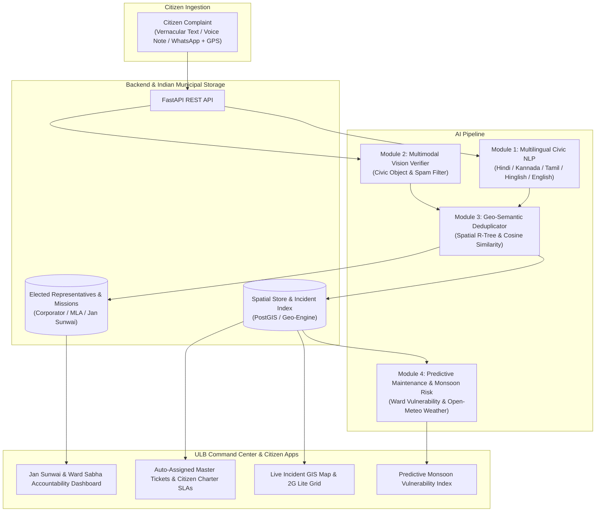

# SamAashwas (CivicSense AI) 🏛️🇮🇳

**Municipal Grievance Intelligence, Jan Sunwai & Predictive Maintenance Platform for Indian Urban Local Bodies (ULBs)**

[](LICENSE)
[](https://python.org)
[](https://fastapi.tiangolo.com)
[](https://leafletjs.com)
[](frontend/manifest.json)
[](frontend/js/translations.js)

---

## 📌 Executive Summary

Indian Urban Local Bodies (such as BBMP Bengaluru, BMC Mumbai, MCD Delhi, GHMC Hyderabad, GCC Chennai, PMC Pune) receive tens of thousands of citizen complaints daily across WhatsApp bots, web portals, call centers, and walk-ins. However, existing municipal systems suffer from four critical structural bottlenecks:

1. **Language & Vernacular Barriers:** Citizens describe grievances colloquially in Hindi, Kannada, Tamil, or code-mixed Hinglish (*"Bhaiya road par street light 4 din se band hai"*, *"ರಸ್ತೆಯಲ್ಲಿ ದೊಡ್ಡ ಗುಂಡಿ ಬಿದ್ದಿದೆ"*, *"சாக்கடை நீர் வழிகிறது"*). Keyword-based bots fail to assign the correct ward junior engineer (JE) or department.
2. **Duplicate Flooding:** When a civic failure occurs (e.g., water pipe burst, tree fall, blown transformer), 50–100 neighborhood citizens log separate complaints. Municipal dashboards drown in redundant tickets, paralyzing resolution tracking.
3. **Lack of Democratic Governance Tracking:** Grievances lack linkage to elected representatives (Ward Corporator / Parshad, MLA) and fail to docket critical lingering issues for the weekly **Jan Sunwai / Public Grievance Day** before the Municipal Commissioner or District Magistrate.
4. **Reactive vs. Predictive Maintenance:** Municipal engineers only respond after a catastrophic failure, rather than conducting proactive preventative desilting of stormwater drains (SWD) prior to the monsoon.

**SamAashwas (CivicSense AI)** resolves this with an end-to-end intelligence platform built specifically for Indian citizens and municipal field staff.

---

## 🇮🇳 India-Specific Innovations & Features

### 1. Multi-Lingual Vernacular AI Localization & Instant UI Toggles
- **Supported Languages:** **हिन्दी (Hindi)**, **ಕನ್ನಡ (Kannada)**, **தமிழ் (Tamil)**, **Hinglish**, and **English**.
- **Indic Typography:** Accessible typography using Noto Sans Indic font stacks for seamless rendering on mobile and desktop.
- **Vernacular Speech-to-Text Grievance Ingestion:** Built-in voice note recorder widget and quick vernacular sample grievance chips allowing citizens to report issues orally.
- **WhatsApp-First Experience:** WhatsApp bot simulator with vernacular quick-reply chips (🚧 *Sadak Gaddha*, 💡 *Streetlight Kharab*, 🧹 *Kachra Dump*, 💧 *Paani / Sewer Leak*) and localized polite greetings (*Namaste! 🙏*, *Namaskara! 🙏*, *Vanakkam! 🙏*).

### 2. High-Contrast Outdoor Sunlight Readability Mode & 2G Lite Data
- **☀️ Outdoor Sunlight Mode:** High-contrast design optimized for field municipal engineers inspecting roads and drains in 40°C direct midday Indian sunlight.
- **📶 2G Lite Data Mode:** Disables heavy satellite/map tiles and switches to a low-bandwidth vector ward grid to preserve mobile data on congested 2G/3G connections.
- **📱 PWA Mobile App Support:** Web App Manifest (`manifest.json`) and Service Worker (`sw.js`) enabling offline resilience, asset caching, and standalone home-screen installation.

### 3. Indian Municipal Democratic Governance & Nuances
- **🏛️ Ward Sabha & Corporator / MLA Tracking:**
  - Automatically associates each grievance with the elected **Ward Corporator (Parshad)**, **Constituency MLA**, and official ward committee meeting schedules.
- **⚖️ Jan Sunwai (Public Grievance Day) Escalation:**
  - High-urgency or chronic unaddressed grievances are automatically or manually docketed for Friday's **Jan Sunwai / Samadhan Diwas** hearing before the Municipal Commissioner.
- **🇮🇳 National Flagship Mission Categorization:**
  - Complaints are automatically tagged under official national missions:
    - 🧹 **Swachh Bharat Mission (SBM-Urban 2.0)** (Garbage, solid waste, public sanitation)
    - 💧 **AMRUT 2.0 & Jal Jeevan Mission** (Potable water supply, sewage pipelines, stormwater drainage)
    - 🚦 **Smart Cities Mission / National Street Lighting Program** (Streetlights, sensors, traffic infrastructure)
    - 🛣️ **State PWD & Municipal Road Safety Program** (Road potholes, arterial repair)
- **⏱️ Citizen Charter Statutory SLAs:**
  - Clear countdown timers based on official Indian Citizen Charter rules (e.g., 12h for electrical emergencies, 24h for sanitation, 48h for streetlights, 72h for potholes).
- **🌧️ Monsoon Preparedness & Pre-Monsoon Desilting:**
  - Real-time desilting readiness tracking (% desilted) per ward alongside Open-Meteo precipitation forecasts.

---

## 🌟 The 4 Core AI Modules



---

## 🏛️ Repository Structure

```
SamAashwas/
├── backend/
│   ├── app/
│   │   ├── api/                  # FastAPI routers (complaints, master tickets, predictive, whatsapp, analytics)
│   │   ├── core/                 # Core AI engines (Multilingual NLP, Vision, Deduplication, Predictive)
│   │   ├── db/                   # Database repositories & seed data (1,000+ complaints & wards)
│   │   ├── models/               # Pydantic schemas & domain models (Jan Sunwai, Missions, Corporator)
│   │   ├── utils/                # Geo-spatial calculation & Open-Meteo weather client
│   │   ├── config.py             # App configurations
│   │   └── main.py               # Application entry point with PWA & static mounting
├── frontend/                     # Interactive Officer Command Center & Citizen Portal
│   ├── css/styles.css            # Sunlight mode, Indic typography & responsive layout
│   ├── js/translations.js        # Multi-lingual translations (Hindi, Kannada, Tamil, Hinglish, English)
│   ├── js/app.js                 # Dashboard controllers, voice recording & Jan Sunwai
│   ├── js/map_view.js            # Leaflet.js GIS interactive layers & 300m spatial gates
│   ├── js/whatsapp_bot.js        # Interactive WhatsApp Bot Simulator with quick chips
│   ├── manifest.json             # PWA Web App Manifest
│   ├── sw.js                     # Offline resilience & service worker
│   └── index.html                # Responsive PWA web application
├── data/
│   ├── synthetic_complaints_1000.json # 1,000+ realistic multilingual complaints
│   ├── municipal_assets.json     # Drainage, road, transformer registry + Corporators/MLAs
│   └── weather_sample.json       # Monsoonal rainfall simulation patterns
├── tests/
│   ├── test_nlp_engine.py        # Unit tests for code-mixed NLP
│   ├── test_vision_engine.py     # Unit tests for vision verification
│   ├── test_deduplication.py     # Unit tests for 300m spatial deduplication
│   ├── test_predictive.py        # Unit tests for ward risk scoring
│   ├── test_api_integration.py   # Integration tests for FastAPI endpoints & PWA
│   └── test_indian_localization.py # Unit tests for Kannada, Tamil, Hindi, Missions & Jan Sunwai
├── docs/
│   ├── ARCHITECTURE.md           # In-depth system design & mathematical specs
│   ├── MUNICIPAL_PLAYBOOK.md     # ULB rollout guide for Municipal Commissioners
│   └── API_DOCUMENTATION.md      # API spec & payload samples
├── Dockerfile                    # Containerization spec
├── docker-compose.yml            # Multi-service setup (App + PostgreSQL)
└── requirements.txt              # Python dependencies
```

---

## 🚀 Quick Start Guide

### 1. Prerequisites
- Python 3.10+
- (Optional) Docker & Docker Compose

### 2. Installation
```bash
# Clone the repository
git clone https://github.com/Kanav2605/SamAashwas.git
cd SamAashwas

# Create virtual environment
python -m venv venv
source venv/bin/activate  # On Windows: .\venv\Scripts\activate

# Install dependencies
pip install -r requirements.txt
```

### 3. Running the Backend Server
```bash
uvicorn backend.app.main:app --host 0.0.0.0 --port 8000 --reload
```
- Interactive Web App: `http://localhost:8000/`
- API Documentation (Swagger UI): `http://localhost:8000/docs`
- Health Check: `http://localhost:8000/api/v1/health`

### 4. Running the Standalone Frontend
You can also view the frontend directly via any static HTTP server:
```bash
python -m http.server 3000 --directory frontend
```
Navigate to `http://localhost:3000`.

---

## 🧪 Automated Test Suite

SamAashwas includes 30 end-to-end automated tests covering:
- Multilingual Kannada, Tamil, Hindi, Hinglish, and English entity extraction and routing
- Spatio-temporal 300-meter clustering and deduplication
- Computer vision authenticity verification
- Predictive monsoon risk index calculation
- Voice note grievance ingestion
- Jan Sunwai docketing and public grievance escalation
- WhatsApp webhook multi-lingual processing

Run the entire test suite with:
```bash
pytest -v tests/
```

---

## 🛡️ License
This project is open-source under the [MIT License](LICENSE). Dedicated to the empowerment and civic welfare of the people of India.
