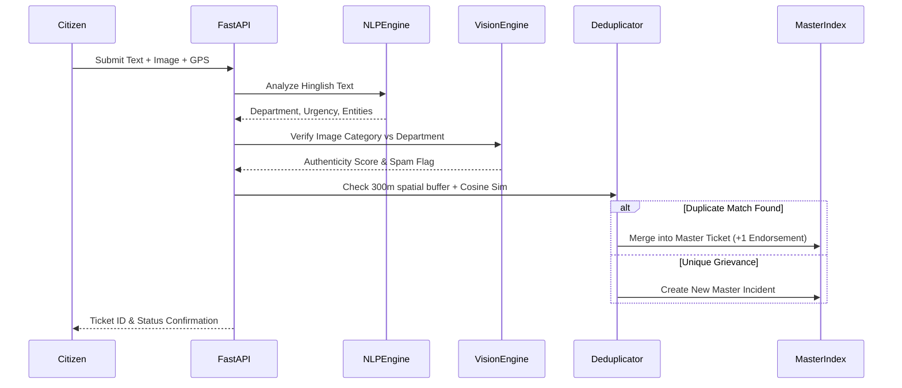

# System Architecture Specification: CivicSense AI (SamAashwas)

## 1. High-Level Mathematical and Architectural Design

CivicSense AI transforms municipal governance from fragmented, reactive ticketing into an automated, proactive spatial intelligence pipeline.

---

## 2. Spatio-Temporal Deduplication Formulation

### 2.1 Geographic Gating Metric
Given a new incoming complaint $C_{\text{new}} = (\text{lat}_1, \text{lon}_1)$ and an existing active Master Incident $M_k = (\text{lat}_2, \text{lon}_2)$, the great-circle spatial distance $D_H(C_{\text{new}}, M_k)$ is computed using the Haversine equation:

$$\Delta\phi = \phi_2 - \phi_1, \quad \Delta\lambda = \lambda_2 - \lambda_1$$
$$a = \sin^2\left(\frac{\Delta\phi}{2}\right) + \cos(\phi_1)\cos(\phi_2)\sin^2\left(\frac{\Delta\lambda}{2}\right)$$
$$D_H = 2 R \cdot \arctan2(\sqrt{a}, \sqrt{1-a})$$

Where $R = 6,371,000 \text{ m}$ (mean Earth radius).
**Geographic Gate:**
$$\text{SpatialMatch}(C_{\text{new}}, M_k) = \begin{cases} 1 & \text{if } D_H \le 300\text{ m} \\ 0 & \text{otherwise} \end{cases}$$

### 2.2 Sub-Word Semantic Cosine Similarity
To account for diverse Romanized phonetic transliterations in Hinglish (e.g., *"sadak"* vs *"sarak"*, *"choked"* vs *"chocked"*, *"gaddha"* vs *"gadda"*), text $T$ is tokenized into character $n$-grams ($n \in [3, 5]$).

The similarity between vector embeddings $\vec{v}(T_{\text{new}})$ and $\vec{v}(T_{M_k})$ is:

$$S(T_{\text{new}}, T_{M_k}) = \frac{\vec{v}(T_{\text{new}}) \cdot \vec{v}(T_{M_k})}{\|\vec{v}(T_{\text{new}})\| \|\vec{v}(T_{M_k})\|}$$

### 2.3 Cluster Decision Rule
$$C_{\text{new}} \in M_k \iff \text{Dept}(C_{\text{new}}) == \text{Dept}(M_k) \land D_H \le 300\text{ m} \land S(T_{\text{new}}, T_{M_k}) \ge 0.82$$

If true:
- Increment citizen report count: $N(M_k) \leftarrow N(M_k) + 1$
- Re-evaluate SLA urgency dynamically:
  $$U(M_k) = \begin{cases} \text{Critical} & \text{if } N(M_k) \ge 15 \\ \text{High} & \text{if } N(M_k) \ge 5 \\ U_{\text{orig}} & \text{otherwise} \end{cases}$$

---

## 3. Predictive Ward Vulnerability Index (WVI)

The pre-monsoon failure risk for Ward $W_i$ is evaluated over a 48-hour forward window:

$$\text{WVI}(W_i) = w_r \cdot \mathcal{F}_{\text{rain}} + w_t \cdot \mathcal{F}_{\text{topo}} + w_d \cdot \mathcal{F}_{\text{drain}} + w_g \cdot \mathcal{F}_{\text{grievance}}$$

Where:
- $\mathcal{F}_{\text{rain}} = \min\left(100, \frac{P_{48\text{h}}}{75.0} \times 100\right)$ (Rain severity factor based on 75mm waterlogging baseline)
- $\mathcal{F}_{\text{topo}} = 85.0$ if designated low-lying basin, else $25.0$
- $\mathcal{F}_{\text{drain}} = \max(0, 100 - \text{CoveragePct})$
- $\mathcal{F}_{\text{grievance}} = \min(100, N_{\text{active}} \times 5.0)$
- Weights: $w_r = 0.35, w_t = 0.25, w_d = 0.20, w_g = 0.20$

---

## 4. Multimodal Vision Verification Protocol

